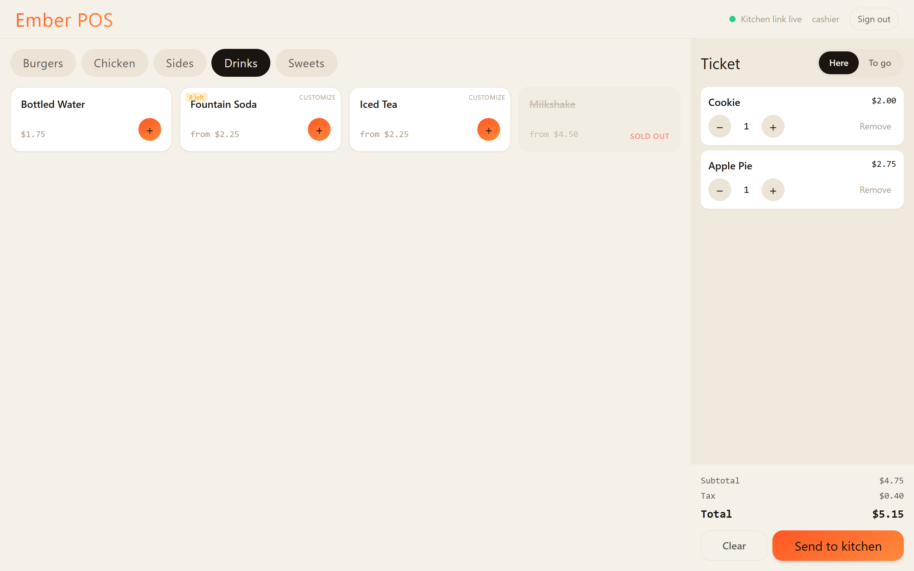
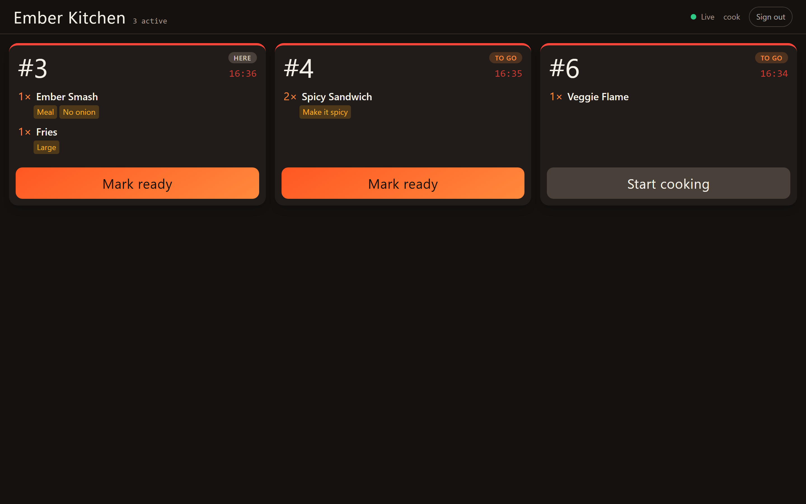
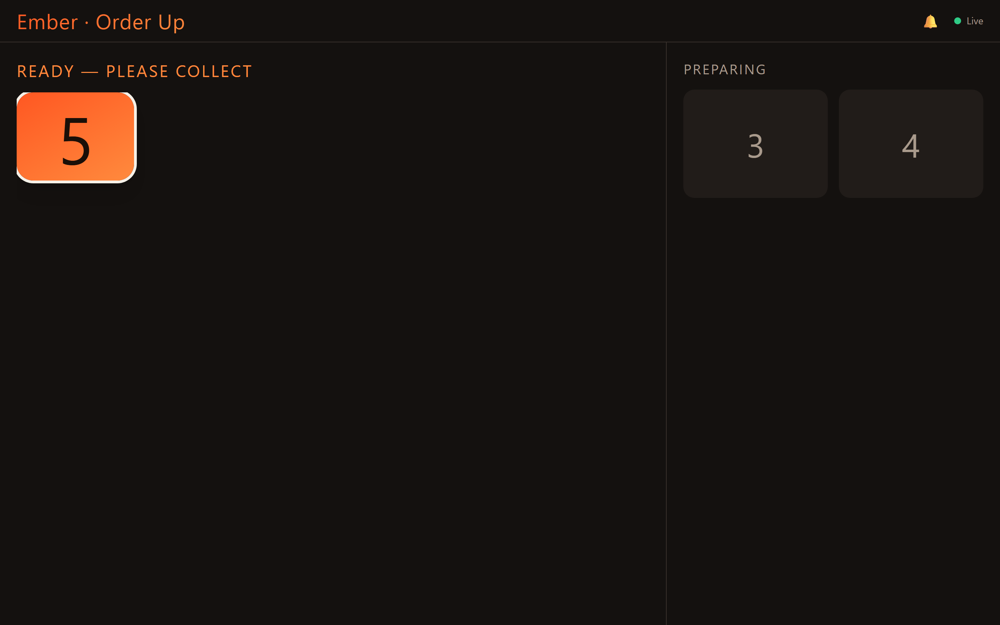
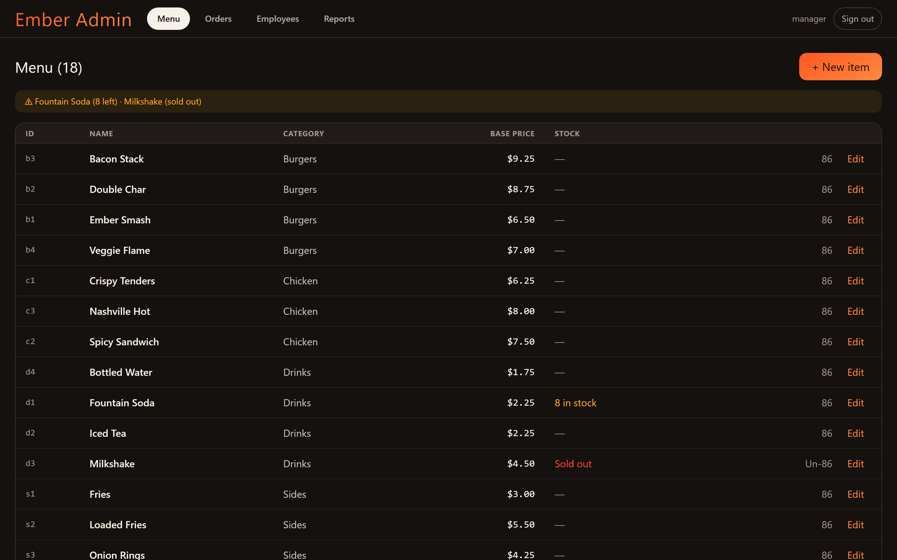
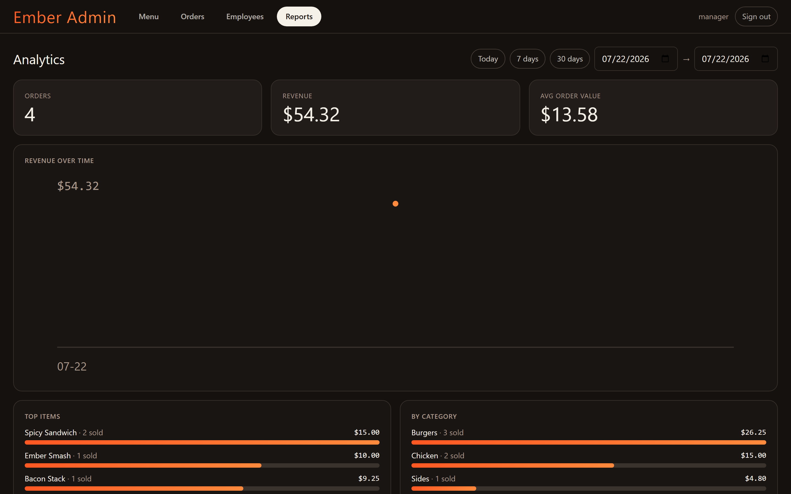
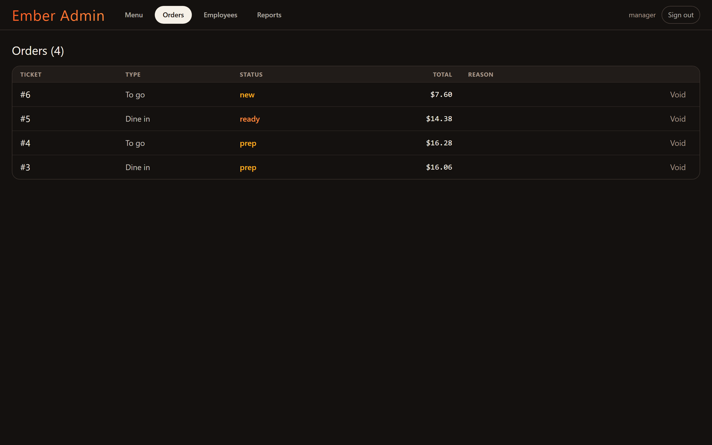
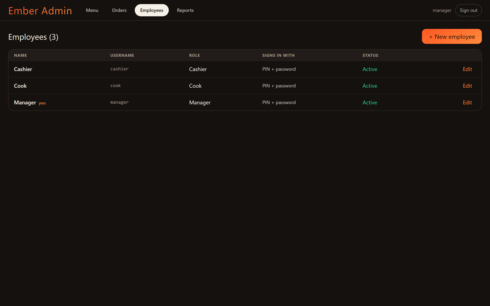

# 🔥 Ember — Quick-Service Management System

Ember runs the floor of a small fast-food outlet across **four screens that share one live order stream**: a cashier **POS**, a **Kitchen Display (KDS)**, a customer **Pickup Board**, and a manager **Admin** back-office.

> **Core principle — the server owns truth.** Pricing, ticket numbers, stock and order state all live server-side. Clients send *intent* (item ids + choices, "advance", "collect"); every change is broadcast over WebSocket and each screen reacts in real time.

<p align="center">
  
</p>

---

## Contents

- [Screens](#screens)
- [Features](#features)
- [Architecture](#architecture)
- [Getting started](#getting-started)
- [Demo credentials](#demo-credentials)
- [Testing](#testing)
- [Project structure](#project-structure)

---

## Screens

### POS — cashier
Build an order from the menu grid, customize (size / make-it-a-meal / add-ons / kitchen note), and send it to the kitchen. Sold-out items grey out; low stock shows an "N left" badge.


### Kitchen Display (KDS) — line cooks
The live rail of active tickets, oldest first, with a colour-coded age timer (green → amber → red) and one-tap **Start cooking → Mark ready**. A bumped ticket leaves the rail instantly.



### Pickup Board — customers
Big ember numbers under **Preparing** and **Ready — please collect**. New ready calls pulse (and chime); tap a number to collect it.



### Admin — managers
A back-office for the menu, orders, reporting and staff.

| Menu & inventory | Analytics |
|---|---|
|  |  |
| **Orders (void / refund)** | **Employees** |
|  |  |

---

## Features

**Ordering & fulfilment**
- Server-priced orders (BigDecimal, scale-2) — the POS never sends a price
- Live POS → KDS → Board flow over one STOMP topic; reload- and reconnect-safe
- Age-coloured kitchen timers; recall a mis-bumped ticket

**Back-office (managers)**
- **Menu admin** — create/edit/delete items, sizes, add-ons, prices
- **Inventory & low-stock** — per-item stock tracking, decrement on sale, 86 / un-86, sold-out enforcement, low-stock alerts (stock is restored when an order is voided)
- **Voids & refunds** — cancel active orders or refund completed ones with a reason; excluded from net sales
- **Analytics** — orders, revenue, average order value, sales over time, top items, category & order-type split, peak hours, and per-staff sales
- **Employees** — a real staff store with per-employee **PIN** (stations) and **password** (admin), role management, and reset/deactivate

**Auth & roles**
- JWT auth with roles `CASHIER`, `COOK`, `MANAGER`
- Stations sign in with a **PIN pad** (pick your name → punch your PIN); the admin uses a password
- Mutations are role-gated; menu reads and the customer board stay public

---

## Architecture

```
┌─────────┐  ┌─────────┐  ┌─────────┐  ┌─────────┐
│  POS    │  │ Kitchen │  │  Board  │  │  Admin  │   React 18 + TS + Vite + Tailwind
│ :5173   │  │ :5174   │  │ :5175   │  │ :5176   │   (4 apps share packages/shared)
└────┬────┘  └────┬────┘  └────┬────┘  └────┬────┘
     │  REST + STOMP/WebSocket │            │
     └───────────────┬─────────┴────────────┘
              ┌───────▼────────┐
              │  Spring Boot   │  REST /api/**  +  STOMP /ws → /topic/orders
              │   backend      │  JWT security · JPA · Flyway
              └───────┬────────┘
              ┌───────▼────────┐
              │  PostgreSQL    │  (H2 in dev)
              └────────────────┘
```

- **Backend** — Java 21, Spring Boot 3.4 (Web, Data JPA, WebSocket, Security, Validation), Flyway migrations, JWT (jjwt). H2 in dev, PostgreSQL in prod (`ddl-auto: validate`).
- **Frontend** — pnpm workspaces: three station apps + an admin app, all consuming `packages/shared` (typed API client, Zustand order store, SockJS/STOMP hook, design tokens + Tailwind preset).
- **Realtime** — the backend broadcasts after commit (`@TransactionalEventListener(AFTER_COMMIT)`); every app keeps one store keyed by `order.id` and derives its view by filtering on status.

---

## Getting started

**Prerequisites:** Java 21, Maven, Node 20+, pnpm.

### 1. Backend (H2, seeds the menu + demo staff)

```bash
cd backend
mvn spring-boot:run            # http://localhost:8080
```

### 2. Frontend apps

```bash
pnpm install
pnpm dev:pos       # http://localhost:5173
pnpm dev:kitchen   # http://localhost:5174
pnpm dev:board     # http://localhost:5175
pnpm dev:admin     # http://localhost:5176
```

The apps default to `http://localhost:8080` for the API; override with `VITE_API_BASE` (e.g. an `apps/pos/.env.local`) if the backend runs elsewhere.

### 3. Try the flow
Open the four screens side by side → sign in on the POS (**Cashier / 1111**) → build and send an order → watch it on the Kitchen (**Cook / 2222**), advance it, and see the number reach the Board → manage the menu, orders and reports in the Admin (**manager / manager123**).

---

## Demo credentials

| Screen | Sign in |
|---|---|
| **Admin** (`:5176`) | username **manager**, password **manager123** |
| **POS** (`:5173`) | tap **Cashier** → PIN **1111** (or **Manager** → 9999) |
| **Kitchen** (`:5174`) | tap **Cook** → PIN **2222** |
| **Board** (`:5175`) | no login |

> Demo accounts are seeded on first run — change them from the Admin **Employees** tab. Set a real `EMBER_JWT_SECRET` in production.

---

## Testing

```bash
# backend — unit, slice and integration tests (incl. a real STOMP broadcast)
cd backend && mvn test
# also runs the Testcontainers PostgreSQL migration check
cd backend && mvn verify

# frontend — Vitest across the workspace
pnpm test
```

---

## Project structure

```
ember/
├── backend/                 # Spring Boot API + WebSocket + security
│   └── src/main/java/com/ember/{domain,repository,service,web,security,config}
├── apps/
│   ├── pos/                 # cashier POS
│   ├── kitchen/             # kitchen display
│   ├── board/               # pickup board
│   └── admin/               # manager back-office
├── packages/shared/         # types, api client, order store, ws hook, design tokens
├── docs/images/             # README screenshots
├── EMBER-SPEC.md            # full build specification
└── CLAUDE.md                # conventions & context
```
